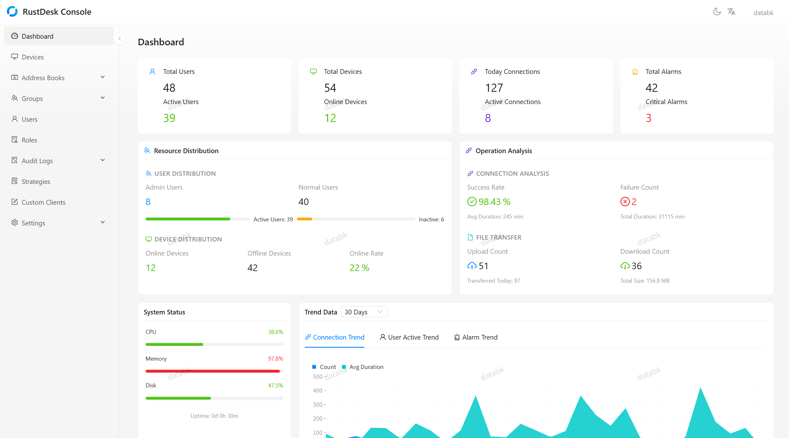
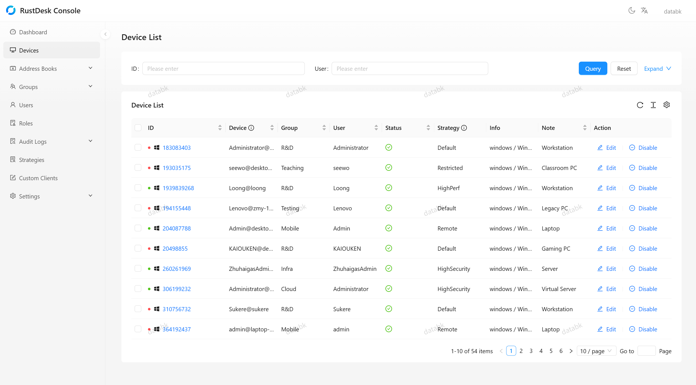

<div align="center">

<a href="https://github.com/databk/rustdesk-console"></a>

# RustDesk Console

**Enterprise-grade management platform for the RustDesk ecosystem**

[](LICENSE)
[](https://nodejs.org/)
[](https://nestjs.com/)
[](https://hub.docker.com/r/databk/rustdesk-console)

[Discord](https://discord.gg/vrQSJfqpwD) · [Frontend Project](https://github.com/databk/rustdesk-console-web)

</div>

---

## ✨ Highlights

<table>
<tr>
<td width="50%">

### 🔐 Authentication & Security
JWT tokens · TOTP 2FA · OIDC SSO · Passkey · Email verification · Rate limiting

</td>
<td width="50%">

### 📱 Device Management
Grouping · Status tracking · Strategy assignment · Batch operations · Force disconnect

</td>
</tr>
<tr>
<td width="50%">

### 📋 Address Book
Personal & shared books · Tag organization · Peer management · Access rules

</td>
<td width="50%">

### 🎯 Strategy Configuration
Device / user / group assignment · Priority resolution · Heartbeat delivery

</td>
</tr>
<tr>
<td width="50%">

### 📊 Dashboard & Analytics
Overview statistics · Trend analysis · Real-time monitoring · Multi-metric support

</td>
<td width="50%">

### 🔍 Audit & Compliance
Connection · File transfer · Security alarm · Console operation logging

</td>
</tr>
</table>

## 🖼️ Screenshots

<table>
<tr>
<td></td>
<td></td>
</tr>
<tr>
<td></td>
<td></td>
</tr>
</table>

## 🚀 Quick Start

> **Default Admin Credentials**: username `databk`, password `databk` — please change before production!

### Docker (Recommended)

Grab the [`docker-compose.yml`](docker-compose.yml) and launch:

```bash
docker compose up -d
```

That's it. The frontend is accessible at `http://localhost:21114`.

<details>
<summary>📋 Docker CLI (without Compose)</summary>

```bash
docker network create rustdesk-net

docker run -d \
  --name rustdesk-console \
  --network rustdesk-net \
  -e JWT_SECRET=your-super-secret-key \
  -v ./data:/data \
  databk/rustdesk-console:latest

docker run -d \
  --name rustdesk-console-web \
  --network rustdesk-net \
  -p 21114:80 \
  -e BACKEND_URL=http://rustdesk-console:3000 \
  databk/rustdesk-console-web:latest
```

</details>

<details>
<summary>🔧 Build from Source</summary>

```bash
git clone https://github.com/databk/rustdesk-console.git
cd rustdesk-console
npm install
cp .env.example .env
# Edit .env with your configuration
npm run build
npm run start:prod
```

**Requirements**: Node.js ≥ 20.0.0, npm ≥ 9.0.0

</details>

## 🛠️ Tech Stack

`NestJS 11` · `TypeScript` · `TypeORM 0.3` · `SQLite` · `JWT` · `Passport.js` · `bcryptjs` · `otplib` · `Nodemailer` · `sharp` · `openid-client`

## 🤝 Contributing

See [CONTRIBUTING.md](CONTRIBUTING.md) for development setup, coding conventions, and contribution guidelines.

---

<p align="center">
  <strong>Built with ❤️ using NestJS | Data Block</strong>
</p>
